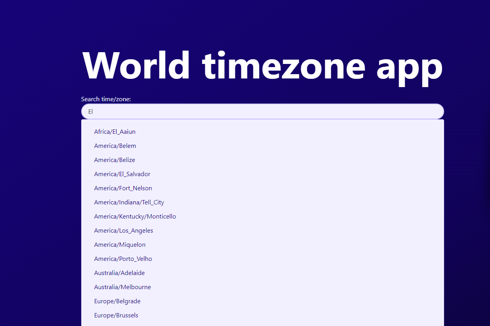
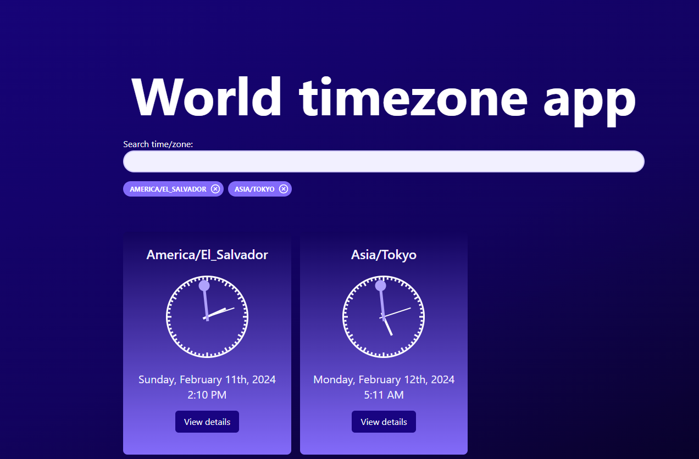
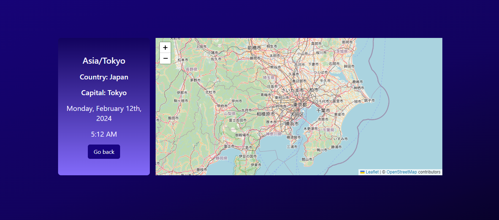

# World clock app

World clock app is a web application that allows users to search for multiple time zones and view detailed information about each one. It provides real-time data and includes a detailed view for each time zone, displaying a map and additional details.

## Features

- Search for multiple time zones, you can also search by path params using timeZone query (/?timeZone=America/El_Salvador)


- View real-time data for each time zone


- Access detailed view for each time zone, including a map and additional details



## Libraries
- Leaflet to display the map location.

- date-fns to format dates.

- react-clock to render a clock component.

## Installation

To install the project, follow these steps:

```bash
git clone https://github.com/AMRV22/world-clock-app.git
cd world-clock/app
npm install